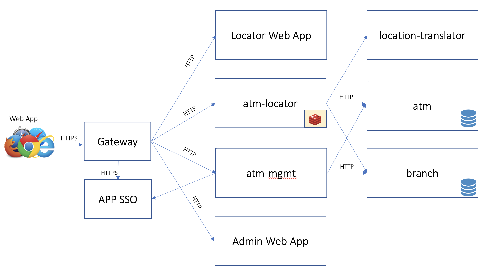

# atm-locator-backend

## Description
The services contained in this repo make up the backend system of the ATM locator application.  It consists a set of polyglot micro-services that communicate
internally to implement a public search API as well as a protected management API.  The backend is comprosed of the following services:

* [atm-locator](atm-locator/README.md): This is the primary public facing service that implements the search API; it does not require authentication.  It acts a business logic and aggregate service that communicates with the following three internal services described below.
* [location-translator](location-translator/README.md) Internal micro-service that translates a combination of a city/state pair or a zip code into global coordinates (i.e. latitude and longitude). 
* [atm](atm/README.md) Internal micro-service that maintains a list of ATMs including their names, locations, and associations to branch locations.
* **branch** Internal micro-service that maintains a list of bank branches including their names, locations, and operating hours.
* **atm-mgmt** Public facing service that implements the ATM and Branch management APIs; it requires authentication.  The API exposes basic CRUD operations and including associations between ATMs and branches.

The public facing APIs are intended to be accessed by web UI front ends to create
* An interactive ATM location search application.  This application will use the `atm-locator` API.
* An application for managing ATM locations and branches.  This application will use the `atm-mgmt` API.  

## Functional Use Case

The backend services expose APIs that facilitate two primary functional use cases via web applications:

- The primary use case is an application for searching ATM locations based on zip code or city/state as well as a search radius.  The results include coordinates in latitude/longitude along with the distance (in miles) from the search location.  The results should allow for an interactive web app experience.

- An administrative application for performing management operations.  This includes adding and deleting ATM and branch locations.

## Application Architecture:

The services listed in the description enumerate a catalog of workloads that make up the most complex configuration of the atm-locator backend services.  The high level architecture of the full catalog (including the web apps) looks like the following

The full service catalog implements a robust application architecture that illustrates a similar real world customer deployment.  Although this is useful for validating complex system architectures on Tanzu platforms, there are several incremental value streams that can be tested and validated using a much smaller footprint of the full catalog.  For instance, a validation of the simple REST API with a backing database scenario could be implemented by deploying only the ATM service.  Various permutations of the service catalog similarly model other scenarios and value streams.  Services have been purposely implemented with these situation in mind and support multiple deployment variations.

## Customer Scenarios

