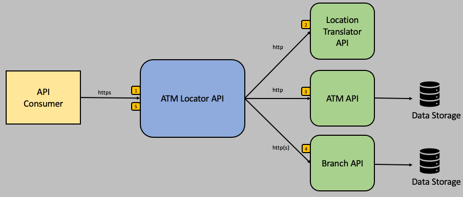

# atm-locator

## Description
The atm-locator service is the primary public facing API used for searching for ATM locations.  The API requires either a city/state or postal code to locate ATMs within a search radius.  Because city/state and postal codes denote general location vicinities vs a specific location, the API also accepts an optional address to create a more specific location request.  These location request parameters are translated into geographic coordinated (i.e. longitude and latitude), however, many front end application modalities have the ability to procure relatively accurate geolocation data.  For the reason, the API will also accept longitude and latitude in lieu of city/state and/or postal code.  The API also accepts a search radius parameters, however it will default to a 10 miles if a search radius is not provided. 

## Operation

The atm-locator is an aggregate service and relies on APIs from other services to perform its function.  The basic functional sequence is:

1. Validate the incoming request parameters.  City/state, postal code, or longitude/latitude are required.
2. If city/state or postal code are provided, translate these parameters to longitude/latitude.  This is generally done by calling the [location-translator](../location-translator/README.md) service API.
3. Search for ATMs using longitude/latitude.  This is accomplished by calling the `atm` service API.
4. If an ATM object has a contains a reference to a branch, acquire the bank branch information.  This is accomplished by calling the `branch` service API.
5. Return the qualifying ATM objects.



## API

### Search ATMs

  Searches for ATMs within a given location and search radius.  Location can be provided either as city/state, postal code, or longitude latitude.  If using city/state or postal code, an optional address can be provided for more a specific location.
  
* **URL**

  /atmsearch
  
* **Method:**

  `GET`
  
*  **Query Params**

   **Required (if using city/state):**
 
   `city=[string]`
   
   **Required (if using city/state):**
 
   `state=[string]`
   
   **Required (if using postal code):**
 
   `postalCode=[string]`      

   **Required (if using longitude/latitude):**
 
   `longitude=[float]` 
   
   **Required (if using longitude/latitude):**
 
   `latitude=[float]`
   
   **Optional:**
 
   `address=[string]`    
   
   **Optional:**
 
   `radius=[integer]` <br/><br/>
   Default value: 10

* **Success Response:**

  * **Code:** 200 <br />
    **Sample Content:** 
    ```
    [
      {
        "id": 2,
        "name": "Quick Trip Liberty North",
        "coordinates": {
          "latitude": 39.268436,
          "longitude": -94.5223
        },
        "addr": "10150 NE Cookingham Dr",
        "city": "Kansas City",
        "state": "MO",
        "postalCode": "64157",
        "distance": 3.4046943,
        "details": [],
        "notes": [],
        "inDoors": false,
        "branch": null
      }
    ]    
    ```

* **Sample Call:**

  ```
  curl -X 'GET' 'https://atm-locator.perfect300rock.com/atmsearch?postalCode=64157&radius=10' -H 'accept: */*'
  ```
  
