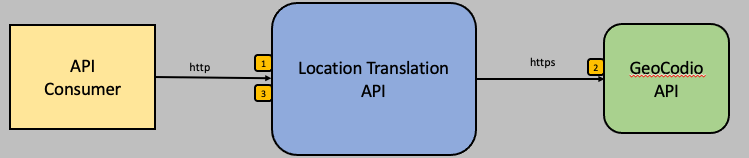

# location-translator

## Description
The location-translator service responsible for translating city/state or postal code monikers to geolocation coordinates (i.e. latitude/longitude).  The API requires either a city/state or postal code.  Because city/state and postal codes denote general location vicinities vs a specific location, the API also accepts an optional address to create a more specific translation request.  In the context of the [atm-locator](../atm-locator/README.md) service, the translator is an early stage operation of the multi-step process to locate ATM machines.  
<br>
This service is generally intended to be deployed as an internal service as part of the `atm-locator-backend` stack, however it can be deployed as a public stand alone service for the purpose of scenario and value stream validation.

## Operation

The location-translator is architected to support multiple implementations of resolving location monikers to geolocation coordinates.  The internal `GeoLocator` interface defines a single operation to execute the translation process.

```
public interface GeoLocator 
{
	public Mono<Location> translateToLocation(String address, String city, String state, String postalCode);
}
```

Business logic is deferred to specific implementations of this interface.  An instance of this interface is injected into the REST API controller which directly calls the `translateToLocation` method.

### GeocodIO Implementation

The GeocodIODemoLocator implementation makes REST calls to the `https://api.geocod.io/v1.7/geocode` endpoint using a DEMO API key.  The GeocodIO API is backed by data from the IS and Canadian census to translate locations to geolocation coordinates.  It accepts a liberal representation of addresses as well as abreviations and long form or states and provinces.  This implementation is limited to US and Canadian locations and may not work within air gapped environment.

The basic functional sequence is:

1. Validate the incoming request parameters.  City/state or postal code is required.
2. Call out to the Geocodio API to translate input parameters into geolocation coordinates.
3. Return the geolocation coordinates as a tuple of longitude/latitude.



## API

### Translate location

  Translates and city/state or postal moniker into geolocation coordinates.   An optional address can be provided for more a specific location translation.  This service will return an empty tuple if the location does not exist or cannot be found.
  
* **URL**

  /loc
  
* **Method:**

  `GET`
  
*  **Query Params**

   **Required (if using city/state):**
 
   `city=[string]`
   
   **Required (if using city/state):**
 
   `state=[string]`
   
   **Required (if using postal code):**
 
   `postalCode=[string]`      
   
   **Optional:**
 
   `address=[string]`    

* **Success Response:**

  * **Code:** 200 <br />
    **Sample Content:** 
    ```
    {"latitude":39.267857,"longitude":-94.47296}  
    ```

  
